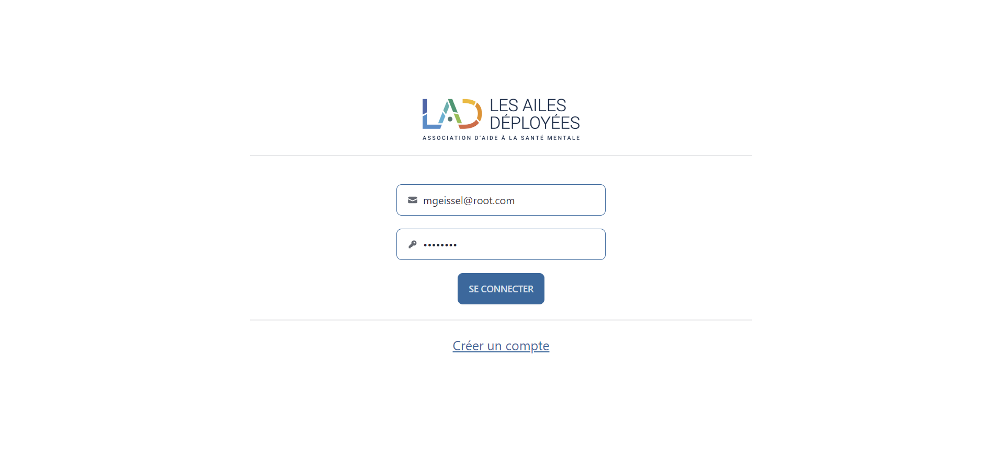

<h2 align="center">
  JAC 2023 - Mathieu Geissel
</h2>

  

## The Project
Les Ailes Déployées is a web project designed to digitalize and streamline the reservation process in the association’s restaurants. This platform allows users to view availability and book tables online, simplifying the reservation management process for both members and administrators. With this real-time booking system, the association can offer a smoother, more organized experience to visitors while optimizing seating capacity in its establishments.

### Features

**🍽 Online Reservations**

**📊 Administrators Dashboard**

**💡 Automated Notifications**

**👥 User Profile Management**

**⏱ Real-Time Availability Management**

## Technical Stack
The website is developed in AngularJS for the front-end and NestJS for the Back-End, both using TypeScript. The front-end uses daisyUI and the back-end uses TypeORM to communicate with the PostgreSQL database.

It uses `yarn` as a package manager for both the front-end and the back-end.

## Getting started

Clone down this repository. You will the repos for the front-end (jac-front) and for the back-end (jac-back).
